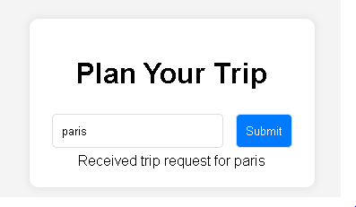

# Travel App 🚀

## 📌 Introduction
The **Travel App** is a web application that allows users to enter a city name to check the expected weather conditions, along with displaying an image of the city. The app relies on multiple **APIs** to fetch and display data in an organized manner.

---

## 📁 **Project Structure**
```
Travel-Final/
│── client/
│   │── index.js
│   │── js/
│   │   └── app.js
│   │── styles/
│   │   └── style.scss
│   │── views/
│   │   └── index.html
│── server/
│   └── server.js
│── webpack.dev.js
│── webpack.prod.js
│── package.json
│── .babelrc
│── .gitignore
│── README.md
```

---

## 🛠 **Prerequisites**
To ensure the app runs properly, make sure you have the following installed:
- **Node.js** (latest version recommended)
- **NPM** or **Yarn** for package management

You can check if Node.js is installed using the following commands:
```sh
node -v
npm -v
```

---

## 🔧 **Installation & Running the App**

### 📥 1️⃣ Install Dependencies
After downloading the project, open **Terminal** or **Command Prompt**, navigate to the project directory, and run:
```sh
npm install
```
📌 This will download all the required libraries listed in `package.json`.

---

### 🚀 2️⃣ Run in Development Mode
If you want to run the app in development mode, use the following command:
```sh
npm run dev
```
📌 This command will start the Webpack Dev Server with **automatic reloading** on code changes.

---

### 🏗 3️⃣ Build for Production
To prepare the app for deployment, run:
```sh
npm run build
```
📌 This will generate the production-ready compressed files inside the `dist/` folder.

---

### 🌐 4️⃣ Start the Server
To start the local server, run:
```sh
npm run start
```
📌 This will launch the **local server on port `8081`**.

If you encounter an `EADDRINUSE` error (port already in use), stop the process using the following command:
```sh
npx kill-port 8081
```
Then restart the server.

---

## 🔗 **APIs Used**
1️⃣ **GeoNames API** 🔹 Fetches geographical coordinates (latitude, longitude, country name).
2️⃣ **WeatherBit API** 🔹 Retrieves weather data based on city coordinates.
3️⃣ **Pixabay API** 🔹 Fetches an image of the city based on its name.

✍ **Note**: You must add your **API Keys** inside the `.env` file.

---

## 📜 **How the App Works**

1️⃣ **User enters a city name** in the input field.
2️⃣ **A request is sent to GeoNames API** to get the coordinates.
3️⃣ **The coordinates are sent to WeatherBit API** to fetch weather data.
4️⃣ **The city name is used to search for an image in Pixabay API**.
5️⃣ **The retrieved data is displayed on the homepage**.

---

## 📌 **Common Issues & Solutions**
🔴 **Issue**: `MODULE_NOT_FOUND` when running `npm run build`.
✅ **Solution**: Ensure all dependencies are installed by running:
```sh
npm install
```

🔴 **Issue**: `EADDRINUSE` when running `npm start`.
✅ **Solution**: Stop any process using the same port with:
```sh
npx kill-port 8081
```
Then restart the server.

🔴 **Issue**: `Invalid options object. Dev Server has been initialized using an options object that does not match the API schema.`
✅ **Solution**: Update Webpack and Webpack Dev Server by running:
```sh
npm update webpack webpack-dev-server
```

---

## 🎯 **Future Enhancements**
🔹 Support **date input** to fetch forecasted weather.
🔹 Improve UI design using **advanced CSS**.
🔹 Add an option to **save favorite destinations** in the browser.

---

## 📌 **Author**
This app was developed as part of the **FEND Capstone Project** 🎓.

✨ **Good luck! 🚀**

